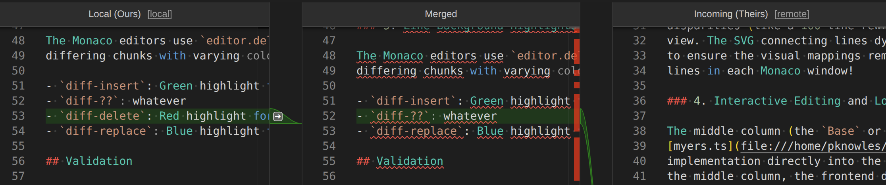

# Meld 3-Way Merge for VS Code


*Our extension presents an intuitive layout, clear connections, and can automatically resolve conflicts that standard git tools miss.*

This extension brings the power of [Meld's](https://meldmerge.org/) intuitive 3-way merge view and advanced auto-merge heuristics directly into Visual Studio Code.

## ⚠️ Alpha Release Notice

This extension is currently in **alpha**.

It is very early in development and the codebase is still brand new. Features may be incomplete, behavior may change without notice, and **bugs are expected**.

Please only try this release if:

- You’re comfortable testing early-stage software  
- Your work is properly backed up  
- You’re okay with potential instability or unexpected behavior  

If you encounter issues, feedback is welcome — but don’t be surprised if things break. That’s part of the alpha process.

Yes, this is written with AI. Even though under my guidance, it still does a lot of really dumb stuff and it's really hard forcing it not to.

Use at your own discretion.

## Why Use This?

VS Code's built-in Git conflict resolution is excellent, but its standard interface can sometimes be visually noisy and challenging to navigate during complex merges:


*Standard VS Code 3-way view.*

Even the improved built-in 3-way view can still feel less intuitive than dedicated desktop tools like Meld:


*Improved VS Code 3-way view.*

**Meld for VS Code** provides a cleaner, dedicated 3-way merge editor modeled right after the Meld application. Beyond the improved UI, it brings Meld's highly-tuned conflict resolution algorithm that is capable of:

- Resolving changes separated by whitespace.
- Handling complex insert/delete overlaps with unambiguous resolutions.
- Automatically interpolating conflict blocks to find common ground.

The end result? An intuitive merge experience that handles the tedious work for you.


*Conflict resolution made intuitive – Meld resolves conflicts automatically when VS Code cannot.*

## Features

### 🔀 3-Way Merge Editor
A seamless, visually distinct 3-way merge interface opening directly inside your editor for any conflicted files. See local, base, and remote versions side-by-side with clear connections to the merged output.

### ✨ Auto-Merge Conflicted Files
Manually trigger auto-merge at any time via the Command Palette: **"Meld: Auto-Merge Current File"**. This extracts the **LOCAL**, **BASE**, and **REMOTE** versions via Git and runs them through the Meld `AutoMergeDiffer`, applying the highly-optimized merged result to your editor.

### 🛠️ Quality of Life Git Tools (Source Control UI)
The extension contributes a **Meld Conflicted Files** view to the native Source Control (SCM) panel, displaying all current conflicts. Each file has inline actions:
- 🚀 **Checkout Conflicted (-m)**: Quickly reset a botched merge attempt in the active file back to its original conflicted state with `git checkout -m`. (Asks for confirmation)
- 🧠 **Rerere Forget File**: Tell Git to forget any automatically recorded resolution for the file using `git rerere forget`. (Asks for confirmation)
- ✅ **Smart Git Add**: A safer `git add` that verifies absolutely no conflict markers (`<<<<<<<`) remain in the file before staging it.
- 🔀 **Open 3-Way Merge Editor**: Opens the file in the custom Meld 3-way setup.

## How It Works

To ensure maximum performance and zero external dependencies, we have **ported Meld's core Python logic to pure TypeScript**.

This includes:
- **`myers.ts`**: A high-performance `O(NP)` diff algorithm with Meld's custom k-mer inline matching.
- **`diffutil.ts`**: Advanced sequence management and chunk tracking.
- **`merge.ts`**: The 3-way merge logic and powerful `AutoMergeDiffer` heuristics.

The logic runs entirely within the VS Code extension host process—no Python installation or background daemons required.

## Getting Started

1. Open a project with Git merge conflicts.
2. Find the conflicted file in the SCM panel or the new "Meld Conflicted Files" view.
3. Open it in the 3-Way Merge Editor. 
4. Watch as the robust heuristics auto-resolve many blocks for you, leaving only the complex decisions for you to handle through the intuitive UI!

## Developer Setup

To run this extension locally for development or testing:

1. **Clone the repository.**
2. **Navigate to the extension directory**:
   ```bash
   cd vscode-extension
   ```
3. **Install dependencies**:
   ```bash
   npm install
   ```
4. **Compile the extension**:
   ```bash
   npm run compile
   ```
5. **Launch in VS Code**:
   - Open the `vscode-extension` folder in VS Code.
   - Press `F5` to open a new "Extension Development Host" window with the extension loaded.

### Testing and Packaging

We use Jest to verify the TypeScript port against Meld's original logic:

```bash
cd vscode-extension
npm test
npm lint
npm compile
npx vsce package
```

## Credits

This VS Code extension is authored and maintained by Pyarelal Knowles, 2026.

It is a port of the [Meld](https://meldmerge.org/) visual diff and merge tool,
originally written in Python. All credit for the core algorithm design, advanced
diffing heuristics, and 3-way merge logic and fantastic UI belongs to the
original Meld developers. This extension aims to bring their hard work and
excellent merge experience into the VS Code ecosystem.

## License

GPL Version 2; see [LICENSE](LICENSE).
