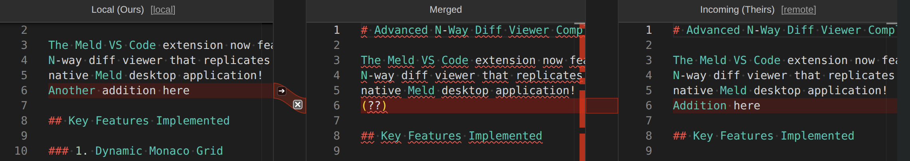
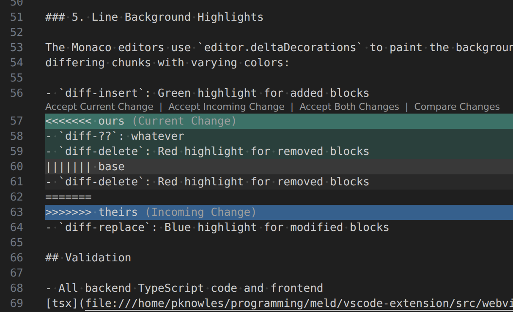
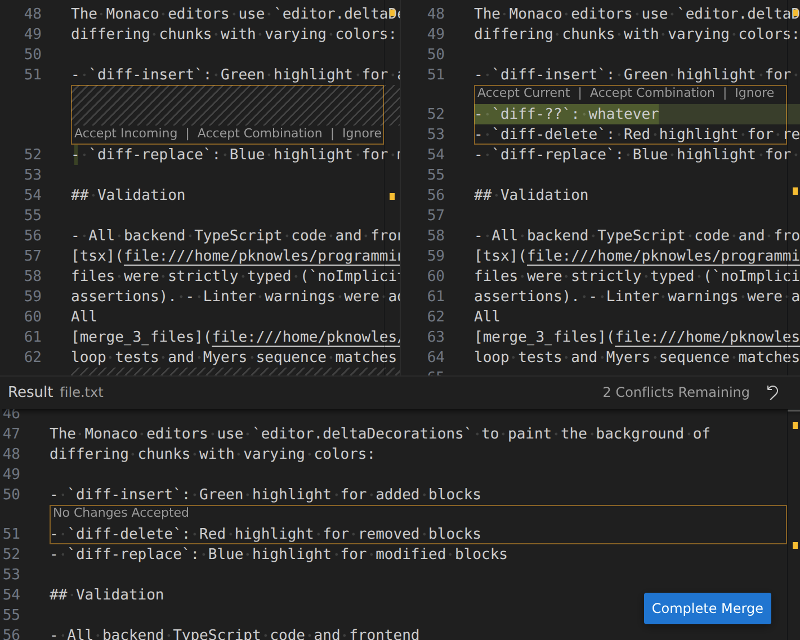

# Weld Merge — A Meld-Style 3-Way Git Merge Tool for VS Code

[](https://marketplace.visualstudio.com/items?itemName=pknowles.meld-auto-merge)


Weld Merge is a VS Code extension that replicates the fantastic 3-way merge
algorithm and interface from the classic [Meld](https://meldmerge.org/)
diff/merge tool.


*Boost developer productivity with an intuitive layout, clear connections, and automated resolutions that standard git tools miss.*

This extension brings the power of [Meld's](https://meldmerge.org/) intuitive
frontend diff viewer and advanced auto-merge heuristics *natively* into Visual
Studio Code. This implicitly includes remote developer support. If you're
looking for a dedicated 3-way merge tool and superior Git merge conflict
resolution, this Visual Studio Code Git extension provides an unmatched
developer experience.

## Table of Contents
- [Alpha Release Notice](#️-alpha-release-notice)
- [Installation](#installation)
- [Why Use This?](#why-use-this)
- [Features](#features)
- [How It Works](#how-it-works)
- [How to Use the Extension](#how-to-use-the-extension)
- [Configuration Settings](#configuration-settings)
- [Developer Setup](#developer-setup)
- [Credits](#credits)
- [License](#license)
- [Feedback & Support](#feedback--support)

## ⚠️ Alpha Release Notice

This extension is currently in **alpha**.

While the core Meld algorithms have been carefully ported and tested, the VS Code UI integration is under active development. Features may be incomplete, behavior may change without notice, and **bugs are expected**.

Please review your merges carefully and report any bugs you find!

Use at your own discretion.

## Installation

1. In VS Code, open the Extensions view (`Ctrl+Shift+X`).
2. Search for "Weld Merge".
3. Click "Install".

Or use Quick Open (Ctrl+P), paste the following command, and press enter:

```
ext install pknowles.meld-auto-merge
```

Want to install from source? See [Developer Setup](#developer-setup).

## Why Use This?

VS Code's built-in Git conflict resolution is excellent, but its standard
interface can sometimes be visually noisy and challenging to navigate during
complex merges:


*Standard VS Code inline conflict view.*

Even the improved built-in 3-way view can still feel less intuitive than
dedicated desktop tools like Meld:


*Standard VS Code 3-way conflict view.*

**Weld Merge for VS Code** provides a cleaner, dedicated 3-way merge editor modeled
right after the Meld application. Beyond the improved UI, it brings Meld's
highly-tuned conflict resolution algorithm that is capable of:

- Resolving changes separated by whitespace.
- Handling complex insert/delete overlaps with unambiguous resolutions.
- Automatically interpolating conflict blocks to find common ground.

The end result? An intuitive merge experience that handles the tedious work for
you.


*Conflict resolution made intuitive – Weld resolves conflicts automatically when VS Code cannot.*

## Features

### 3-Way Merge Editor

A side-by-side merge editor that opens directly in VS Code. See local, base, and
remote versions with clear visual connections to the merged output.

- **Local** - The version of the file in your current branch before the conflict.
- **Remote** - The version that you're merging in, e.g. with `git merge`, `git
  cherry-pick`, `git am` etc.
- **Base** - The common ancestor of both the local and remote versions of the
  file.
- **Merged** - The result and work-in-progress of the merge.

The highlighted colors represent:

- **Red** - Conflicts that need your attention.
- **Green** - Simple additions and deletions (if you want separate, you can override them).
- **Blue** - Rewritten lines that are not conflicts.

### 5-Way Compare to Base

Easily toggle diffs between Base and Local/Remote. This is handy to understand
what changes were made to arrive at Local and Remote states before deciding how
to handle the merge conflicts. Necessary for the more difficult conflicts.

### Auto-Merge

Manually trigger auto-merge at any time via the Command Palette: **"Weld:
Auto-Merge Current File"**. This extracts the **LOCAL**, **BASE**, and
**REMOTE** versions via Git and runs them through the Meld `AutoMergeDiffer`,
applying Meld's auto-merge operation. There are sometimes cases where conflicts
detected by git and VS Code can be resolved automatically. This operation
happens when you open the 3-way merge editor too.

### Source Control Panel

The extension adds a **Weld Merge : Conflicted Files** view to the native Source Control (SCM) panel. `Alt + M` to open by default (`Cmd + Alt + M` on Mac).

- **Primary Action (Click)**: Opens the **Weld 3-way merge editor** (native to VS Code, not an external app).
- **Inline Actions**:
  - **Smart Git Add** (icon): A safer `git add` that verifies no conflict markers (`<<<<<<<`) remain in the file before staging.
  - **Checkout Conflicted** (icon, for resolved files): Reset a botched merge attempt back to the original conflicted state via `git checkout -m`. (Asks for confirmation)
- **Context Menu (Right-Click)**:
  - **Auto-Merge Current File**: Runs Meld's auto-merge heuristics.
  - **Checkout Conflicted (-m)**: Reset a botched merge attempt back to the original conflicted state via `git checkout -m`. (Asks for confirmation)
  - **Rerere Forget File**: Tell Git to forget any automatically recorded resolution via `git rerere forget`. (Asks for confirmation)
  - **Open File (Default Editor)**: Opens the file in the standard VS Code editor.
  - **Open VS Code's 3-Way Merge Editor**: Opens the file in the default VS Code 3-way merge editor.

## How It Works

This is a straight diff algorithm port plus a reimplementation of the 3-way Meld
UI in javascript.

To ensure maximum performance and zero external dependencies, we have **ported Meld's core Python logic to pure TypeScript**.

This includes:

- **`myers.ts`**: A high-performance `O(NP)` diff algorithm with Meld's custom k-mer inline matching.
- **`diffutil.ts`**: Advanced sequence management and chunk tracking.
- **`merge.ts`**: The 3-way merge logic and powerful `AutoMergeDiffer` heuristics.

The logic runs entirely within the VS Code extension host process—no Python installation or background daemons required.

## How to Use the Extension

### From the Source Control Tab

1. Open a project that currently has Git merge conflicts.
2. Click on the Source Control icon in your Activity Bar
3. Under the standard "Source Control" view, you will see a new collapsible
   section titled **Weld Merge : Conflicted Files**. The command **Source
   Control : Focus on Weld Merge : Conflicted Files View** gets you here too,
   searchable in the command palette or with `Alt + M` by default (`Cmd + Alt +
   M` on Mac).
4. Expanding this tab will show a list of all files currently marked as conflicted.
5. **Click a file** to open it in the custom **Weld 3-way merge editor**.
6. Edit the center panel with the help of the arrows and crosses over the
   colored connection lines. When done, click **Save & Complete Merge** (or `Ctrl+S`
   followed by the **Smart Git Add** icon in the conflict list).

### From the Command Palette (`Ctrl+Shift+P`)

If you already have a conflicted file actively open in your regular VS Code editor:

1. Press `Ctrl+Shift+P` (or `Cmd+Shift+P` on Mac) to open the Command Palette.
2. Type **Weld: 3-Way Merge Conflict Editor** and hit Enter.
3. The custom 3-way merge viewer will open up immediately for that file.
4. *(Optional)* Alternatively, you can run the **Weld: Auto-Merge Current File**
   in case there are low hanging fruit conflicts that can be auto-resolved.

### Resolving Merge Conflicts

Just the basics. The middle Merged column is what you want the file to be after
merging. The left Local column is what's in the branch you're on and the right
Remote column is what you're trying to merge into the Local code. If it's not
obvious what the final result should be, try opening the **Compare to Base**
columns (the buttons next to the column titles) and ask yourself this:

1. *What is it the diff from Base to Local is trying to do?*
2. *What is it the diff from Base to Remote is trying to do?*
3. *How can I write the code that does both these things?

In most cases you won't need **Compare to Base** but for the more tricky merge
conflicts it can be incredibly useful. This is a feature I tacked on to the
original Meld GUI. Tangent: you can actually add command line parameters to have
the real Meld app launch with these diffs as extra tabs!

## Keyboard Shortcuts

The Merged editor supports the following navigation shortcuts (Meld-style):

| Action | Shortcut |
|---|---|
| **Previous Diff** | `Alt + Up` |
| **Next Diff** | `Alt + Down` |
| **Previous Conflict** | `Ctrl + J` |
| **Next Conflict** | `Ctrl + K` |

The following global shortcut is available to quickly access the conflicted files list:

| Action | Shortcut |
|---|---|
| **Focus Conflict List** | `Alt + M` | (or `Cmd + Alt + M` on Mac)

Please note that these default shortcuts may conflict with existing VS Code commands (e.g., `Alt+Up/Down` for "Move Line", `Ctrl+J` for "Toggle Panel"). 

Shortcuts in the Merged editor (Previous/Next Diff/Conflict) are active **only when the editor has focus**. If they interfere with your workflow or you prefer VS Code's defaults, please be aware that we are considering leaving these **unbound by default** in future versions to avoid collisions.

**Feedback Wanted:** Should these stay bound to the Merged editor by default, or should they be opt-in? Let us know in the [issues](https://github.com/pknowles/weld-merge/issues)!

## Configuration Settings

You can customize the extension using the following VS Code settings (accessible via `File > Preferences > Settings`):

| Setting | Default | Description |
|---|---|---|
| `weld.mergeEditor.debounceDelay` | `300` | Delay in milliseconds before recomputing diff highlights while typing. |
| `weld.mergeEditor.syntaxHighlighting` | `true` | Enable or disable syntax highlighting in the merge editor. |

### Theme Colors

All diff highlight colors are fully themeable via the workbench `colorCustomizations` setting in your `settings.json`:

| Color Token | Default | Description |
|---|---|---|
| `weldMerge.diffInsertBackground` | `#00c80026` | Background for inserted lines. |
| `weldMerge.diffDeleteBackground` | `#00c80026` | Background for deleted lines. |
| `weldMerge.diffReplaceBackground` | `#0064ff26` | Background for replaced lines. |
| `weldMerge.diffReplaceInlineBackground` | `#0064ff59` | Highlight for inline changed text within replaced lines. |
| `weldMerge.diffConflictBackground` | `#ff000026` | Background for unresolved conflict lines. |
| `weldMerge.diffCurtainInsertFill` | `#00c80033` | Fill color for insert regions in the connecting curtain SVG. |
| `weldMerge.diffCurtainInsertStroke` | `#00c80080` | Stroke color for insert regions in the connecting curtain SVG. |
| `weldMerge.diffCurtainDeleteFill` | `#00c80033` | Fill color for delete regions in the connecting curtain SVG. |
| `weldMerge.diffCurtainDeleteStroke` | `#00c80080` | Stroke color for delete regions in the connecting curtain SVG. |
| `weldMerge.diffCurtainReplaceFill` | `#0064ff33` | Fill color for replace regions in the connecting curtain SVG. |
| `weldMerge.diffCurtainReplaceStroke` | `#0064ff80` | Stroke color for replace regions in the connecting curtain SVG. |
| `weldMerge.diffCurtainConflictFill` | `#ff000033` | Fill color for conflict regions in the connecting curtain SVG. |
| `weldMerge.diffCurtainConflictStroke` | `#ff000080` | Stroke color for conflict regions in the connecting curtain SVG. |

Example `settings.json` snippet to tweak colors:

```json
"workbench.colorCustomizations": {
    "weldMerge.diffConflictBackground": "#ff00001a",
    "weldMerge.diffInsertBackground": "#00ff001a"
}
```

## Developer Setup

### Run from Source (F5 Launch)

1. Clone the repository and open the root folder in VS Code.
2. Install dependencies:
   ```bash
   npm install
   ```
3. Build the extension:
   ```bash
   npm run build
   ```
4. Press **`F5`** to open a new "Extension Development Host" window with the extension loaded.

### Testing, Packaging & Manual Install

We use Jest to verify the TypeScript port against Meld's original Python logic:

```bash
npm test              # run unit tests
npm run test:coverage # run unit tests with code coverage report
npm run test:mutate   # run Stryker mutation testing
npm run test:fuzz     # run Jazzer.js fuzz testing
npm run test:bench    # run performance benchmarks (logic & UI)
npm run lint          # lint and format check
npm run build         # build, lint etc
npx vsce package      # build a .vsix installer
```

To install the built `.vsix` locally:

1. In VS Code, open the Extensions view (`Ctrl+Shift+X`).
2. Click the `...` menu in the top-right corner of the panel.
3. Select **Install from VSIX...**
4. Locate the downloaded file and click **Install**.

## Credits

Ported and maintained by Pyarelal Knowles. This is a TypeScript port of the
[Meld](https://meldmerge.org/) visual diff and merge tool; all credit for the
core algorithm and fantastic 3-way merge UI belongs to the original Meld
developers.

## License

GPL Version 2; see [LICENSE](LICENSE).

## Feedback & Support

If you encounter a bug, have a feature request, or just want to share feedback, please file an issue on our GitHub repository at:  
[https://github.com/pknowles/weld-merge/issues](https://github.com/pknowles/weld-merge/issues)
