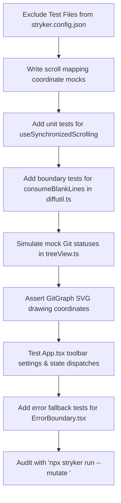

# Mutation Testing Audit Report
**Date:** May 25, 2026  
**Overall Mutation Score:** 41.36% (Breaking Threshold: 65%)

This audit report identifies critical areas in the codebase where tests are either entirely missing or too weak to catch bugs (mutants). It highlights specific coverage gaps, explains why they are under-tested, provides concrete examples of survived mutants, and offers an actionable roadmap for future agents or developers to improve the test suite.

---

## 🔍 Critical Configuration Leak Detected
> [!IMPORTANT]
> **Stryker was mutating test files when this audit was written.**  
> Several test files were located directly inside the `src/` directory (e.g., `src/webview/ui/scrollMapping.test.ts`). Because `stryker.config.json` mutated all `src/**/*.ts` files, it spent CPU cycles introducing bugs into the tests themselves. These tests now live under `test/webview/`; keep `src/` production-only.
>
> **Action Required:** Update the `"mutate"` array in [stryker.config.json](file:///home/pknowles/programming/weld-merge/stryker.config.json) to exclude test files:
> ```json
> "mutate": [
>   "src/**/*.ts",
>   "src/**/*.tsx",
>   "!src/**/*.d.ts",
>   "!src/extension.ts",
>   "!src/**/*.test.ts",
>   "!src/**/*.test.tsx"
> ]
> ```

---

## 📁 Summary of Mutation Scores by Component

Below is a breakdown of the valid mutation scores across the repository's modules, fully comprehensive of all webview UI, scroll mapping, diff algorithms, and editor action modules:

| Component / File Area | Mutation Score | Key Stats (Killed / Survived / NoCoverage) | Risk Level |
| :--- | :--- | :--- | :--- |
| **Extension & Host Infrastructure** | **0.00%** | 0 Killed / 5 Survived / 389 NoCoverage | 🛑 Critical |
| **Git & Workspace Context** | **0.82% – 20.89%** | 40 Killed / 71 Survived / 293 NoCoverage | 🛑 Critical |
| **Monaco UI & Synchronized Scrolling** | **8.57% – 38.30%** | 217 Killed / 241 Survived / 241 NoCoverage | ⚠️ High |
| **Core Diff Algorithms, Matchers & Highlighting** | **23.08% – 59.68%** | 660 Killed / 461 Survived / 203 NoCoverage | ⚠️ High |
| **Submodule UI & Conflict Editors** | **25.00% – 56.90%** | 234 Killed / 196 Survived / 91 NoCoverage | 🟡 Medium |
| **Main React Application Shell & Layout** | **28.57% – 60.49%** | 152 Killed / 154 Survived / 30 NoCoverage | 🟡 Medium |
| **Utility Functions & Guards** | **67.12% – 100.00%** | 69 Killed / 25 Survived / 2 NoCoverage | 🟢 Low |

---

## 🛠️ Deep-Dive Audit & Targeted Test Specifications

### 1. Extension & Host Infrastructure (Score: 0.00%)

#### Target Files:
*   [meldWebviewPanel.ts](file:///home/pknowles/programming/weld-merge/src/webview/meldWebviewPanel.ts) (0.00% - 293 mutants in `NoCoverage`)
*   [diffPayload.ts](file:///home/pknowles/programming/weld-merge/src/webview/diffPayload.ts) (0.00% - 73 mutants in `NoCoverage`)
*   [useClipboardOverrides.ts](file:///home/pknowles/programming/weld-merge/src/webview/ui/useClipboardOverrides.ts) (0.00% - 3 Survived, 20 `NoCoverage`)

#### What the Code Does:
*   `meldWebviewPanel.ts`: Acts as the host container in the extension Node.js thread, managing panel lifetimes, instantiating the webview, registering event listeners via `panel.webview.onDidReceiveMessage`, checking out Git indexes, spawning external diff threads, and passing payloads back to React via `postMessage`.
*   `diffPayload.ts`: Fetches file states for unmerged conflict blocks from Git (reading indexes for local, merged, and remote branches) and builds the initial payload sent to the webview.
*   `useClipboardOverrides.ts`: Intercepts Monaco editor copy, cut, and paste commands. When inside VS Code, it uses `postMessage` to request host-side clipboard access via VS Code APIs; when running standalone in browsers, it falls back to standard browser `navigator.clipboard` APIs.

#### Survived Mutants Analysis:
*   In `useClipboardOverrides.ts`, mutants that skip checkouts of the VS Code message bus (e.g., removing `if (!vscodeApi)`) survive because tests never simulate environments without the VS Code environment, or fail to assert that clipboard reads actually resolve to text.
*   In `meldWebviewPanel.ts`, handling the communication messages sent via `postMessage` is untested at the unit level.

#### Specific, Targeted Test Strategy:
1.  **Mocking the VS Code Host Handshake:**
    Create mock panel instances in Jest tests using [mockVscode.ts](file:///home/pknowles/programming/weld-merge/test/mockVscode.ts). Simulate a `"ready"` message event coming from the webview:
    ```typescript
    const onMessageEmitter = new vscode.EventEmitter<any>();
    const panel = { webview: { onDidReceiveMessage: onMessageEmitter.event, postMessage: jest.fn() } };
    // Trigger message event
    onMessageEmitter.fire({ command: 'ready' });
    // Assert postMessage is called with 'loadDiff' payload containing the files array
    expect(panel.webview.postMessage).toHaveBeenCalledWith(
        expect.objectContaining({ command: 'loadDiff' })
    );
    ```
2.  **Clipboard Fallback Test:**
    Test `useClipboardOverrides` directly via `@testing-library/react-hooks`:
    *   **Case A (VS Code Environment):** Inject a mock `useVscodeMessageBus` returning `{ postMessage: jest.fn() }`. Trigger `requestClipboardText()`. Verify `postMessage` is called with `{ command: "readClipboard", requestId: 1 }`. Call `resolveClipboardRead(1, "test text")` and assert the promise resolves to `"test text"`.
    *   **Case B (Browser Environment):** Set `vscodeApi` to `null`. Stub `navigator.clipboard.readText` to return a resolved promise of `"browser text"`. Assert that `requestClipboardText()` falls back and resolves to `"browser text"`.

---

### 2. Monaco UI Interactions & Synchronized Scrolling (Score: 8.57% – 38.30%)

#### Target Files:
*   [useSynchronizedScrolling.ts](file:///home/pknowles/programming/weld-merge/src/webview/ui/useSynchronizedScrolling.ts) (8.57% - 112 Survived, 16 `NoCoverage`)
*   [scrollMapping.ts](file:///home/pknowles/programming/weld-merge/src/webview/ui/scrollMapping.ts) (38.30% - 35 Survived, 22 `NoCoverage`)
*   [appHooks.ts](file:///home/pknowles/programming/weld-merge/src/webview/ui/appHooks.ts) (27.80% - 133 Survived, 54 `NoCoverage`)
*   [CodePane.tsx](file:///home/pknowles/programming/weld-merge/src/webview/ui/CodePane.tsx) (31.16% - 94 Survived, 149 `NoCoverage`)

#### What the Code Does:
*   `useSynchronizedScrolling.ts`: Hooks Monaco's `onDidScrollChange` events. It uses `getSyncPointY` to calculate layout heights, `getSourceLineDecimal` to run a binary search locating the exact source line under the view middle via `getTopForLineNumber`, and maps coordinates across panes to scroll the targets.
*   `scrollMapping.ts`: Handles the mathematical coordinate calculations for smooth continuous line mapping. It implements a custom upper-bound binary search (`_upperBoundMid`), resolves adjacent gap coordinates, and smoothly maps scrolling heights using linear interpolation (`_interpolate`).
*   `appHooks.ts`: Provides custom React hooks coordinating document reloads, navigation (`findTargetChunk` locating next/prev conflicts), and toolbar click actions.
*   `CodePane.tsx`: Sets up custom Monaco keyboard shortcuts (Copy, Cut, Paste, Save), manages editor rendering configurations, and applies highlight decorations via `deltaDecorations`.

#### Survived Mutants Analysis:
*   In `useSynchronizedScrolling.ts`, changing calculations like `scrollTop / halfPage` to multiplication or modifying binary search indices survives because tests do not verify fractional scrolling coordinates.
*   In `scrollMapping.ts`, off-by-one bounds and implicit gap calculations (such as boundary comparisons `line < sStart` or ratio calculations `s2 - s1 > 0`) survive because mapping calculations are not fuzzed on boundaries.
*   In `CodePane.tsx`, modifying copy/cut boundary handlers (e.g. including `\n` on empty selections or skipping edit operations) survives without breaking tests.

#### Specific, Targeted Test Strategy:
1.  **Direct Scroll Coordinate Calculations:**
    Isolate `getSyncPointY` and test boundaries directly:
    ```typescript
    expect(getSyncPointY(0, 500, 2000)).toEqual({ syncpoint: 0.0, syncY: 0 });
    expect(getSyncPointY(250, 500, 2000)).toEqual({ syncpoint: 0.5, syncY: 500 });
    expect(getSyncPointY(1500, 500, 2000)).toEqual({ syncpoint: 1.0, syncY: 2000 });
    ```
2.  **Smooth Scroll Line Mapping Mocks:**
    Test coordinate mapping using standard `DiffChunk` array parameters:
    ```typescript
    const chunks = [{ tag: "replace", startA: 2, endA: 4, startB: 2, endB: 6 }];
    
    // Test mapping A to B: Midpoint (3) of source [2, 4] maps directly to midpoint (4) of target [2, 6]
    expect(mapLineAcrossChunks(3, { chunks, sourceIsA: true, sourceMaxLines: 10, targetMaxLines: 12 })).toBeCloseTo(4);
    
    // Test mapping before chunk bounds:
    expect(mapLineAcrossChunks(1, { chunks, sourceIsA: true, sourceMaxLines: 10, targetMaxLines: 12 })).toBeCloseTo(1);
    
    // Test mapped boundaries with no chunks:
    expect(mapLineAcrossChunks(5, { chunks: null, sourceIsA: true, sourceMaxLines: 10, targetMaxLines: 12 })).toBeCloseTo(5);
    ```
3.  **Mocking Monaco Heights for Binary Search:**
    Mock a Monaco editor instance where `getTopForLineNumber(line)` returns `(line - 1) * 19` (constant line height of 19px). Assert that `getSourceLineDecimal(mockEditor, 38)` returns exactly `2.0` (line 3).
4.  **Monaco Copy/Cut Actions Integration:**
    Trigger actions registered in `setupActions`:
    *   Mock an editor model containing the text `"Line 1\nLine 2"`. Set an empty selection at line 1.
    *   Execute the `"custom-copy"` action. Assert that the clipboard write callback is triggered with `"Line 1\n"`.
    *   Select characters 1 to 4 (`"Line"`). Execute `"custom-cut"`. Assert that clipboard write receives `"Line"`, and `executeEdits` is triggered replacing that exact range with `""`.

---

### 3. Git & Workspace Context (Score: 0.82% – 20.89%)

#### Target Files:
*   [treeView.ts](file:///home/pknowles/programming/weld-merge/src/treeView.ts) (0.82% - 10 Survived, 111 `NoCoverage`)
*   [gitUtils.ts](file:///home/pknowles/programming/weld-merge/src/gitUtils.ts) (16.31% - 29 Survived, 89 `NoCoverage`)
*   [repoContext.ts](file:///home/pknowles/programming/weld-merge/src/repoContext.ts) (20.89% - 32 Survived, 93 `NoCoverage`)

#### What the Code Does:
*   `treeView.ts`: Instantiates a `ConflictedFilesProvider` class implementing VS Code's `TreeDataProvider`. It retrieves active repositories, checks conflict states using `readConflictState(repository)`, extracts unmerged paths via `mergeChanges`, and decodes resolved files list from `.git/MERGE_MSG` using `_parseMergeMsgConflicts` to build tree items.
*   `gitUtils.ts`: Manages lower-level shell communication, spawning `git status`, locating `.git` directories, and determining conflict types (files vs submodules).
*   `repoContext.ts`: Maps active workspaces, registers workspace change events, and bridges the VS Code built-in Git extension APIs.

#### Survived Mutants Analysis:
*   In `treeView.ts`, the parser conditions inside `_parseMergeMsgConflicts` (such as checking `trimmed === "Conflicts:"` or tab matching `line.startsWith("\t")`) are completely unverified, meaning malformed `.git/MERGE_MSG` formats survive.
*   Repository mismatch state boundaries survive because tests don't simulate repositories that are technically mid-conflict but have empty status arrays.

#### Specific, Targeted Test Strategy:
1.  **Targeting `.git/MERGE_MSG` Parsing:**
    Subclass or expose `_parseMergeMsgConflicts` and test parser boundary structures:
    ```typescript
    const provider = new ConflictedFilesProvider();
    const parse = provider["_parseMergeMsgConflicts"].bind(provider);
    
    // Case A: Correct header and tab boundaries
    expect(parse(["# Conflicts:", "\tsrc/file1.ts", "#\tsrc/file2.tsx"])).toEqual(["src/file1.ts", "src/file2.tsx"]);
    
    // Case B: Space before tab (should be ignored)
    expect(parse(["# Conflicts:", " \tsrc/file1.ts"])).toEqual([]);
    
    // Case C: Halt on non-comment, non-tab lines
    expect(parse(["# Conflicts:", "\tsrc/file1.ts", "trimmed line", "\tsrc/file2.ts"])).toEqual(["src/file1.ts"]);
    ```
2.  **Simulating warning & error tree items:**
    *   Mock `getGitApi().repositories` to return a repository mid-merge where `state.mergeChanges` is empty. Assert that `getChildren()` returns a single `WarningTreeItem` describing the `"Git API mismatch"`.
    *   Configure the file system mock to throw a `new Error("Access Denied")` when reading `MERGE_MSG`. Assert that `getChildren()` returns a persistent `ErrorTreeItem` containing the traceback trace.

---

### 4. Core Diff Algorithms, Matchers & Highlighting (Score: 23.08% – 59.68%)

#### Target Files:
*   [highlightUtil.ts](file:///home/pknowles/programming/weld-merge/src/webview/ui/highlightUtil.ts) (23.08% - 42 Survived, 18 `NoCoverage`)
*   [diffutil.ts](file:///home/pknowles/programming/weld-merge/src/matchers/diffutil.ts) (35.78% - 205 Survived, 136 `NoCoverage`)
*   [myers.ts](file:///home/pknowles/programming/weld-merge/src/matchers/myers.ts) (59.68% - 140 Survived, 39 `NoCoverage`)

#### What the Code Does:
*   `highlightUtil.ts`: Computes whole-line difference decorations as well as character-level inline replacement highlights. It uses `diffChars` from the external `diff` library on sliced line texts to compute precise ranges for modified segments.
*   `diffutil.ts`: Houses complex algorithms for compacting, analyzing, and cleaning raw diff sequences. Important helpers like `consumeBlankLines(chunk, texts, pane1, pane2)` trim empty lines from both sides of a `DiffChunk` to clean highlights.
*   `myers.ts`: An implementation of the Myers O(ND) difference algorithm, running edit scripts, calculating shortest edit paths, and establishing common subsequences.

#### Survived Mutants Analysis:
*   In `highlightUtil.ts`, line additions and offset indices (`startLine + 1`, inline column counts `currentColumn + lines[0].length`, etc.) survive because tests don't assert the column indices of character-level replacement highlights.
*   In `consumeBlankLines`, empty string checks and comparison indices survive because test datasets don't have files with contiguous trailing or leading whitespace blocks at chunk boundaries.
*   In `myers.ts`, path boundary checks and index offsets survive because fuzz/parity tests assert that "it does not crash", but they do not verify exact coordinate results for highly complex, overlapping modifications.

#### Specific, Targeted Test Strategy:
1.  **Asserting Inline Character Difference Highlights:**
    Fabricate a `ReplaceContext` and execute `calculateReplaceHighlights`:
    ```typescript
    const chunk = { tag: "replace", startA: 0, endA: 1, startB: 0, endB: 1 };
    const innerFile = { lines: ["hello"] };
    const outerFile = { lines: ["helo"] };
    
    const highlights = calculateReplaceHighlights({ chunk, useA: true, innerFile, outerFile });
    // Assert exactly one highlight is created targeting the missing character index
    expect(highlights).toEqual([
        expect.objectContaining({
            startLine: 1,
            startColumn: 4, // index of the extra 'l'
            endLine: 1,
            endColumn: 5,
            isWholeLine: false,
            tag: "replace"
        })
    ]);
    ```
2.  **Blank Line Trimming Tests:**
    Target `consumeBlankLines` directly in [test_matchers.test.ts](file:///home/pknowles/programming/weld-merge/test/test_matchers.test.ts):
    ```typescript
    // Forward blank-line trimming:
    const chunk = { tag: "replace", startA: 0, endA: 4, startB: 0, endB: 4 };
    const texts = [["code", ""], ["", "code", "", ""]];
    const result = consumeBlankLines(chunk, texts, 0, 1);
    expect(result).toEqual({ tag: "replace", startA: 0, endA: 1, startB: 1, endB: 2 });
    ```

---

### 5. Submodule UI & Conflict Editors (Score: 25.00% – 56.90%)

#### Target Files:
*   [submoduleConflictEditor.ts](file:///home/pknowles/programming/weld-merge/src/webview/submoduleConflictEditor.ts) (25.00% - 48 Survived, 12 `NoCoverage`)
*   [submoduleConflict.ts](file:///home/pknowles/programming/weld-merge/src/submoduleConflict.ts) (56.90% - 110 Survived, 65 `NoCoverage`)
*   [GitGraph.tsx](file:///home/pknowles/programming/weld-merge/src/webview/submoduleUi/GitGraph.tsx) (42.92% - 94 Survived, 43 `NoCoverage`)
*   [SubmoduleApp.tsx](file:///home/pknowles/programming/weld-merge/src/webview/submoduleUi/SubmoduleApp.tsx) (48.57% - 54 Survived, 36 `NoCoverage`)

#### What the Code Does:
*   `submoduleConflictEditor.ts`: Coordinates opening the Submodule Conflict UI panel. It hooks message listeners, handles submodules base diff loadings, and dispatches graph information (hashes, dates, branches) back to the UI.
*   `submoduleConflict.ts`: Checks submodule versions, validates hashes, and runs fast-forwards/checkouts to automatically resolve submodule conflict states.
*   `GitGraph.tsx`: An SVG graph rendering commit details, drawing connections, circles, and rendering bezier curves matching branches.
*   `SubmoduleApp.tsx`: Manages active submodule panels, coordinating commit details, loading status panels, and clicking details.

#### Survived Mutants Analysis:
*   In `submoduleConflictEditor.ts`, handling the webview panel commands (such as resolving or checkout commands) survives without test coverage of message dispatches.
*   In `GitGraph.tsx`, mutating SVG curve drawing coordinates (like multiplier offsets or spacing heights inside bezier coordinates `C ${x1} ${y1}`) survives because tests check "if the SVG renders", but don't verify coordinate path strings.
*   In `submoduleConflict.ts`, error pathways on shell checkouts survive because tests mock successful checkouts exclusively.

#### Specific, Targeted Test Strategy:
1.  **Testing Submodule Webview Message Commits:**
    Mock a webview panel instance and trigger the `"ready"` command in `SubmoduleConflictEditor`:
    ```typescript
    const editor = new SubmoduleConflictEditor(extensionContext, repo, fileUri);
    // Trigger ready message
    onMessageEmitter.fire({ command: "ready" });
    // Verify it responds by querying git status and loading graph info
    expect(panel.webview.postMessage).toHaveBeenCalledWith(
        expect.objectContaining({ command: "loadGraph" })
    );
    ```
2.  **Validating Bezier path coordinates in `GitGraph.tsx`:**
    Feed a mock commit history tree into `GitGraph` and inspect output DOM tags:
    ```typescript
    const { container } = render(<GitGraph commits={mockCommits} />);
    const path = container.querySelector("path");
    // Assert path string matches exact coordinates (prevents mutants modifying layout offsets)
    expect(path?.getAttribute("d")).toBe("M 20 40 C 20 60, 40 60, 40 80");
    ```
3.  **Testing Submodule resolution failures:**
    Mock shell command executions inside `submoduleConflict.ts`. Configure a command run (like checking if a hash is fast-forwardable) to reject with a shell error exit code. Assert that `resolveSubmoduleConflict` successfully raises a standard unhandled exception and aborts resolution operations.

---

### 6. Main React Application Shell & Layout (Score: 28.57% – 60.49%)

#### Target Files:
*   [App.tsx](file:///home/pknowles/programming/weld-merge/src/webview/ui/App.tsx) (36.73% - 52 Survived, 10 `NoCoverage`)
*   [meldPane.tsx](file:///home/pknowles/programming/weld-merge/src/webview/ui/meldPane.tsx) (60.49% - 62 Survived, 2 `NoCoverage`)
*   [mergedPaneEdits.ts](file:///home/pknowles/programming/weld-merge/src/webview/ui/mergedPaneEdits.ts) (40.54% - 22 Survived, 12 `NoCoverage`)
*   [editorActions.ts](file:///home/pknowles/programming/weld-merge/src/webview/ui/editorActions.ts) (28.57% - 18 Survived, 8 `NoCoverage`)

#### What the Code Does:
*   `App.tsx`: The primary container setting up the React framework layout, loading files, routing host notifications (ready, config changes, edit updates), and maintaining active merge state.
*   `meldPane.tsx`: Handles pane layouts (splitting panels for left, middle, right panes) and toggle configurations.
*   `mergedPaneEdits.ts`: Computes content ranges and delta edits for applying styles and making direct modifications to the merged pane.
*   `editorActions.ts`: Encapsulates direct Monaco editor manipulations such as applying chunk diffs, copying up/down, and deleting code ranges.

#### Survived Mutants Analysis:
*   Boolean toggle states (e.g. changing state variables `showDiffCurtain` or `syntaxHighlighting` defaults) survive because standard mount tests check basic loads, but miss verified settings event dispatches back to the extension host.
*   In `mergedPaneEdits.ts`, replacements for full lines and range bounds calculations survive because full sync edits are not checked for exact delta edits ranges.
*   In `editorActions.ts`, calling text edits without validating range limits survives because tests mock Monaco's execution operations loosely.

#### Specific, Targeted Test Strategy:
1.  **Testing Toolbar dispatch messages:**
    Mock `useVscodeMessageBus` at the module level using Jest mock boundaries:
    ```typescript
    const mockPostMessage = jest.fn();
    jest.mock("./useVSCodeMessageBus.ts", () => ({
        useVscodeMessageBus: () => ({
            postMessage: mockPostMessage,
        }),
    }));

    render(<App />);
    const toggle = screen.getByLabelText("Syntax Highlighting");
    fireEvent.click(toggle);
    // Verify it triggers a configuration update notification to the VS Code host
    expect(mockPostMessage).toHaveBeenCalledWith({
        command: "updateConfig",
        config: expect.objectContaining({ syntaxHighlighting: true })
    });
    ```
2.  **Asserting Curtain Opacity Transitions:**
    Trigger curtain toggling. Verify that the CSS classes or style objects on the curtain overlays transition correctly (e.g., toggling from `opacity: 0` to `opacity: 1`), confirming that mutants changing opacity constants break tests.
3.  **Targeting Merged Pane Full replacement Changes:**
    Assert full replacement boundaries in `contentChangeForFullReplacementFromLines`:
    ```typescript
    const lines = ["hello", "world"];
    const change = contentChangeForFullReplacementFromLines(lines, "new content");
    expect(change).toEqual({
        range: {
            startLineNumber: 1,
            startColumn: 1,
            endLineNumber: 2,
            endColumn: 6
        },
        text: "new content"
    });
    ```
4.  **Targeting Editor Action Ranges:**
    Assert `applyChunkEdit` boundaries on mock Monaco Editors:
    ```typescript
    const editor = createMockMonacoEditor();
    const chunk = { tag: "replace", startA: 1, endA: 3, startB: 1, endB: 5 };
    applyChunkEdit(editor, chunk, "test replacement");
    // Verify executeEdits gets triggered with the exact lines range + column boundaries
    expect(editor.executeEdits).toHaveBeenCalledWith("meld-chunk-edit", [
        expect.objectContaining({
            range: expect.objectContaining({
                startLineNumber: 2,
                endLineNumber: 3
            }),
            text: "test replacement"
        })
    ]);
    ```

---

### 7. Core Diagnostics, Safety & Error Boundaries (Score: 0.00% – 10.53%)

#### Target Files:
*   [ErrorBoundary.tsx](file:///home/pknowles/programming/weld-merge/src/webview/ui/ErrorBoundary.tsx) (10.53% - 2 Survived, 15 `NoCoverage`)
*   [log.ts](file:///home/pknowles/programming/weld-merge/src/log.ts) (0.00% - 2 Survived, 1 `NoCoverage`)

#### What the Code Does:
*   `ErrorBoundary.tsx`: A React class component capturing unhandled rendering errors from child elements. When an error is caught, it captures diagnostic details and displays a fallback trace overlay rather than letting the webview lock up or go completely blank.
*   `log.ts`: Establishes VS Code `LogOutputChannel` instances, handles diagnostics, and raises warnings if methods are accessed before initialization.

#### Survived Mutants Analysis:
*   Mutating `hasError: true` to `hasError: false` inside `ErrorBoundary.getDerivedStateFromError` survives because tests never assert that throwing components actually trigger standard fallback overlays.
*   Mutating exception messages thrown when the log channel is accessed before initialization survives because tests never verify uninitialized checks.

#### Specific, Targeted Test Strategy:
1.  **Simulating rendering exception recovery:**
    Build a helper buggy element and assert boundary rendering behavior:
    ```typescript
    const BuggyComponent = () => { throw new Error("UI Render Crash"); };
    render(
        <ErrorBoundary>
            <BuggyComponent />
        </ErrorBoundary>
    );
    // Verify standard error recovery elements display:
    expect(screen.getByText("Something went wrong.")).toBeInTheDocument();
    expect(screen.getByText(/UI Render Crash/)).toBeInTheDocument();
    ```
2.  **Log Boundary checks:**
    Add tests that execute logging actions before initializing log output:
    ```typescript
    expect(() => getWeldLogChannel()).toThrow("Weld log channel has not been initialized.");
    ```

---

## 📈 Roadmap for High-Impact Test Coverage Improvements

Future agents attempting to raise the mutation score from **41.36% to >65%** should execute these steps in order:



1.  **Quick Win:** Exclude test files from mutation targets in [stryker.config.json](file:///home/pknowles/programming/weld-merge/stryker.config.json) (raises the baseline mutation score immediately by removing false positive test mutants).
2.  **High Yield (Monaco Scroll Sync):** Isolate layout math in [useSynchronizedScrolling.ts](file:///home/pknowles/programming/weld-merge/src/webview/ui/useSynchronizedScrolling.ts) and add test files targeting coordinate transformations.
3.  **Core Robustness (Diff Matchers):** Assert precise boundary indices for whitespace compaction inside [diffutil.ts](file:///home/pknowles/programming/weld-merge/src/matchers/diffutil.ts).
4.  **UI & Extension State (Git Utilities):** Inject simulated Git outputs in parser tests inside [gitUtils.ts](file:///home/pknowles/programming/weld-merge/src/gitUtils.ts).
5.  **Submodule Visuals:** Verify specific SVG drawing coordinates for standard commit trees inside [GitGraph.tsx](file:///home/pknowles/programming/weld-merge/src/webview/submoduleUi/GitGraph.tsx).
6.  **App Shell Configuration:** Mock state changes and toolbar actions inside [App.tsx](file:///home/pknowles/programming/weld-merge/src/webview/ui/App.tsx) and verify Monaco config modifications.
7.  **Resiliency & Diagnostics:** Mount deliberately failing child components in tests for [ErrorBoundary.tsx](file:///home/pknowles/programming/weld-merge/src/webview/ui/ErrorBoundary.tsx) and assert that standard fallback recovery UI displays.
